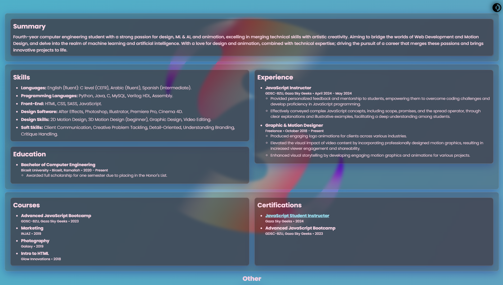

# Resume Webpage

This project is a personal resume webpage built using HTML, CSS, and JavaScript, showcasing various modern web design techniques including glassmorphism, light/dark mode toggling, scroll animations, and more.

## Features

- **Glassmorphism**: Used for various containers to create a frosted glass effect.
- **Light/Dark Mode**: Toggle between light and dark themes.
- **Scroll Animation Button**: Smooth scrolling functionality when clicking the scroll button.
- **Animated Profile Picture**: Profile picture with an animated ring.
- **Animated Gradient Background**: Background with a smoothly transitioning gradient.
- **Responsive Design**: Optimized for different screen sizes, including mobile devices.

## Demo

You can view a live demo of the resume webpage [here](https://samasthtc.github.io/Resume-WebPage-experimenting/).

